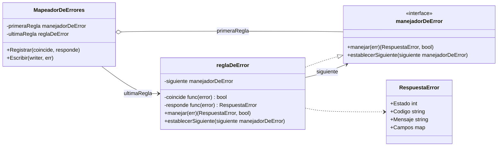

### Chain of Responsibility · `MapeadorDeErrores`

```mermaid
classDiagram
    direction LR

    class MapeadorDeErrores {
        -primeraRegla manejadorDeError
        -ultimaRegla reglaDeError
        +Registrar(coincide, responde)
        +Escribir(writer, err)
    }

    class manejadorDeError {
        <<interface>>
        +manejar(err) (RespuestaError, bool)
        +establecerSiguiente(siguiente manejadorDeError)
    }

    class reglaDeError {
        -coincide func(error) bool
        -responde func(error) RespuestaError
        -siguiente manejadorDeError
        +manejar(err) (RespuestaError, bool)
        +establecerSiguiente(siguiente manejadorDeError)
    }

    class RespuestaError {
        +Estado int
        +Codigo string
        +Mensaje string
        +Campos map
    }

    MapeadorDeErrores o-- manejadorDeError : primeraRegla
    MapeadorDeErrores --> reglaDeError : ultimaRegla
    reglaDeError ..|> manejadorDeError
    reglaDeError --> manejadorDeError : siguiente
    reglaDeError ..> RespuestaError
```
