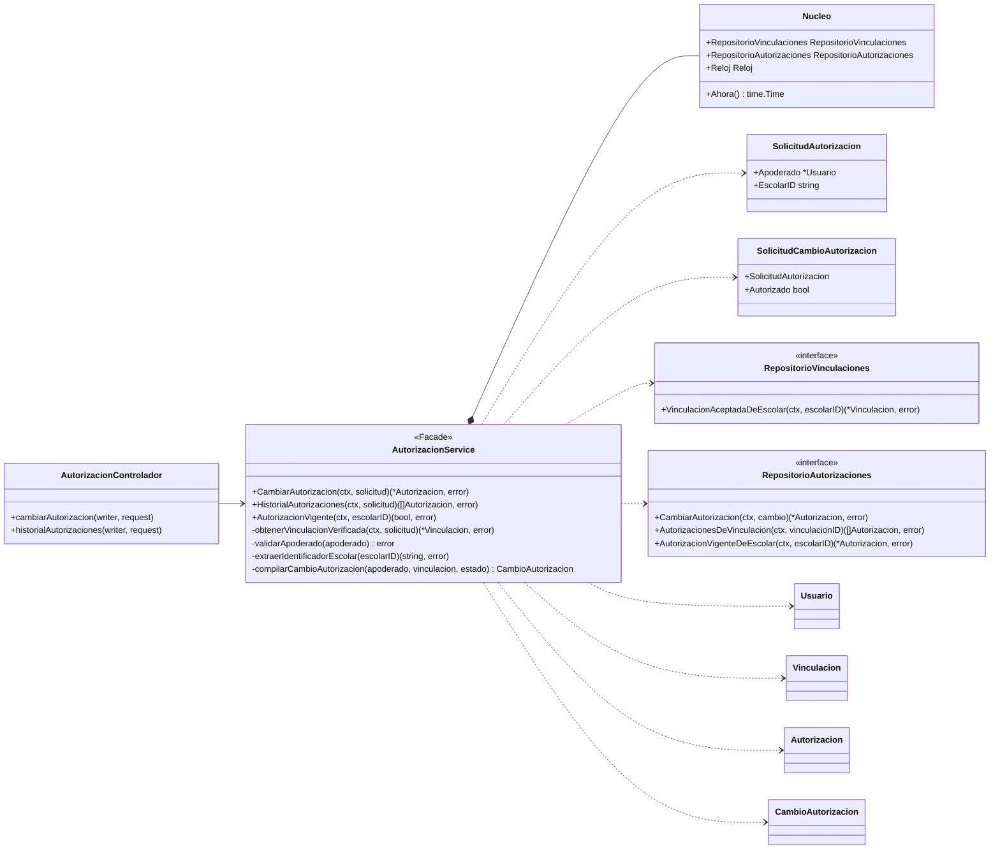

### Facade · `AutorizacionService`

```mermaid
classDiagram
    direction LR

    class AutorizacionControlador {
        +cambiarAutorizacion(writer, request)
        +historialAutorizaciones(writer, request)
    }

    class AutorizacionService {
        <<Facade>>
        +CambiarAutorizacion(ctx, solicitud) (*Autorizacion, error)
        +HistorialAutorizaciones(ctx, solicitud) ([]Autorizacion, error)
        +AutorizacionVigente(ctx, escolarID) (bool, error)
        -obtenerVinculacionVerificada(ctx, solicitud) (*Vinculacion, error)
        -validarApoderado(apoderado) error
        -extraerIdentificadorEscolar(escolarID) (string, error)
        -compilarCambioAutorizacion(apoderado, vinculacion, estado) CambioAutorizacion
    }

    class Nucleo {
        +RepositorioVinculaciones RepositorioVinculaciones
        +RepositorioAutorizaciones RepositorioAutorizaciones
        +Reloj Reloj
        +Ahora() time.Time
    }

    class SolicitudAutorizacion {
        +Apoderado *Usuario
        +EscolarID string
    }

    class SolicitudCambioAutorizacion {
        +SolicitudAutorizacion
        +Autorizado bool
    }

    class RepositorioVinculaciones {
        <<interface>>
        +VinculacionAceptadaDeEscolar(ctx, escolarID) (*Vinculacion, error)
    }

    class RepositorioAutorizaciones {
        <<interface>>
        +CambiarAutorizacion(ctx, cambio) (*Autorizacion, error)
        +AutorizacionesDeVinculacion(ctx, vinculacionID) ([]Autorizacion, error)
        +AutorizacionVigenteDeEscolar(ctx, escolarID) (*Autorizacion, error)
    }

    class Usuario
    class Vinculacion
    class Autorizacion
    class CambioAutorizacion

    AutorizacionControlador --> AutorizacionService
    AutorizacionService *-- Nucleo
    AutorizacionService ..> SolicitudAutorizacion
    AutorizacionService ..> SolicitudCambioAutorizacion
    AutorizacionService ..> RepositorioVinculaciones
    AutorizacionService ..> RepositorioAutorizaciones
    AutorizacionService ..> Usuario
    AutorizacionService ..> Vinculacion
    AutorizacionService ..> Autorizacion
    AutorizacionService ..> CambioAutorizacion
```
